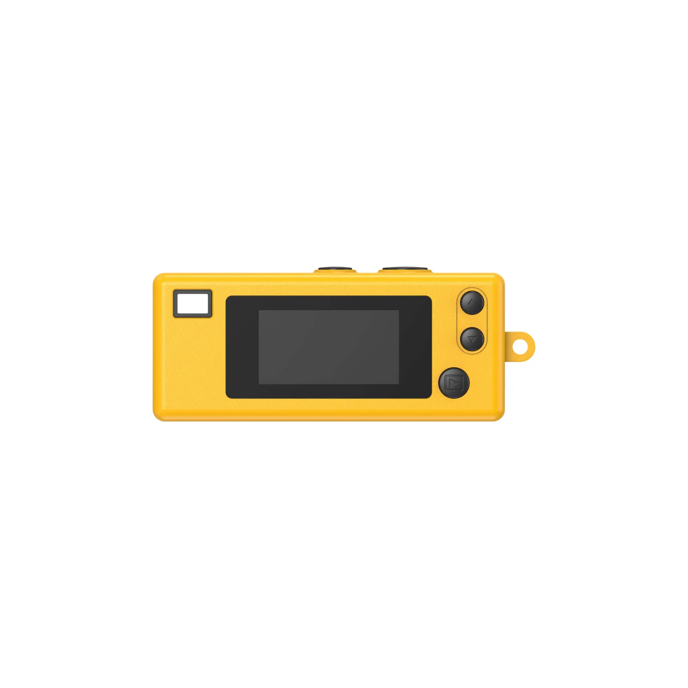

# Mini Kodak Camera — Desktop App

A little desktop app that turns your Mac's webcam into a **Kodak-mini-style
camera**. The whole app *is* the camera: a frameless yellow body with a live,
retro-filtered preview on its mini screen. Press the shutter to snap a warm,
grainy, film-look photo straight to a folder.



## Features

- 🎞️ **Live retro preview** — real-time warm tint, boosted contrast, vignette,
  and film grain on the mini screen (the filter is baked into saved photos too).
- ▶️ **Shutter** — the play button (or **Space**) captures a photo with a white
  flash + a synthesized shutter "cha-chunk", saving to `~/Pictures/KodakMini/`.
- ▲ ▼ **Review mode** — scroll through the shots you've taken this session.
- 🗑️ **Delete** — bottom-left button (or **⌫**) moves the previewed photo to the
  macOS Trash (recoverable).
- ✕ **Quit** — left-side button (or **⌘Q**) closes the frameless app.
- 🔑 **Keychain loop** — click it to open your photo folder in Finder.
- Frameless, transparent, draggable window — drag the body to move it around.

## Controls

| Action        | Button / Key            |
| ------------- | ----------------------- |
| Take photo    | ▶ play button · `Space` |
| Review photos | ▲ / ▼ · `↑` / `↓`       |
| Delete photo  | 🗑 (bottom-left) · `⌫`   |
| Back to live  | `Esc` or the shutter    |
| Open folder   | keychain loop · `o`     |
| Quit          | ✕ (left) · `⌘Q`         |

Photos are saved to `~/Pictures/KodakMini/` as
`kodak_YYYY-MM-DD_HH-MM-SS.jpg`.

## Run it

```bash
npm install
npm start
```

On first launch, macOS will ask for camera permission — allow it and the live
preview appears. If you ever miss the prompt, enable it under
**System Settings → Privacy & Security → Camera**.

## Tech

- [Electron](https://www.electronjs.org/) — frameless/transparent desktop window
- `getUserMedia` + `<canvas>` for the live feed and retro filter
- Web Audio API for the synthesized shutter sound

## Project layout

```
main.js         Electron main process — window + file save/delete/quit (IPC)
preload.js      contextBridge exposing the safe IPC API to the renderer
index.html      the camera face markup
styles.css      the camera-body CSS art
renderer.js     webcam, filter render loop, capture, review, delete
lib/helpers.js  pure helpers (filename + center-crop), unit-tested
test/           node:test unit tests
```

## Tests

```bash
npm test
```
